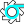

# techui-support

A submodule to supplement [techui-builder](git@github.com:DiamondLightSource/techui-builder).

This contains summary .bob files used by Phoebus as well as Lucide SVG icons for device components.

Here are the most commonly used icons:

| Description | Symbol | Lucide Ref
| --- | --- | ---
| Radiation Monitor |  | (radiation)
| Cryocooler |  | (snowflake)
| Camera |  | (cctv custom)
| Lens |  | (lens-convex)
| Oscilloscope |  | (audio-waveform)
| Light Source |  | (sun)
| Ring On |  | (custom)
| Ring Off |  | (custom)
| Rotation Stage |  | (rotate-cw)
| Translation Stage |  | (move)
| Cog |  | (cog)
| |  |
| |  | 
| |  |
| |  |
| |  |
| |  |
| Slits |  | (slits)

<!-- ## Vacuum

| Widget | Symbol | Description
| --- | --- | ---
| Ion Pump |  |
| Inverted Magnetron Gauge (IMG) |  |
| Pirani Gauge |  |
| Scroll Pump | |
| Fast Valve | .svg>) |
| Gate Valve |  |
| Residual Gas Analyser |  |
| Radiation Monitor |  |
| Absorber |  |

## Motion

| Widget | Symbol | Description
| --- | --- | ---
| Slits | |
Motion Controller
| Filter | 
| Shutter |     | Opening, Open, Closing, Closed |
| Custom Aperture | 
Optical Table
| Monochromator |  |
| Mirror |   | Horizontal/Vertical Focusing Mirrors
| Robot |  |

## Detectors

| Widget | Symbol | Description
| --- | --- | ---
| Webcam |  |
Alignment Camera |  |
Detector

## Diagnostics

| Widget | Symbol | Description
| --- | --- | ---
Diagnostic Stick |  | Without and with camera
Fluorescent Screen |  |
| Ion Chamber |  |
XIA Filter Array | |
| Attenuator |  |

# Other

| Widget | Symbol | Description
| --- | --- | ---
| Collimator |  |
| Chiller |  |
Diode|  |
Cryocooler
Zebra
Panda
| Ring |  | Stored beam off/on -->
